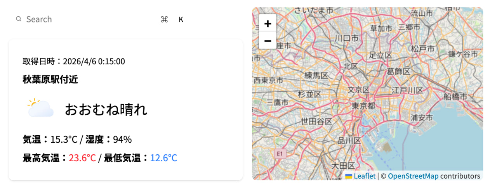

# weather-app

## Screenshot


This is an illustrative image.

## Overview

This is a web application that displays the weather at your current location. The search function will be added at a later date.

## Tech Stack

- React 19
- Vite
- TypeScript
- TailwindCSS / [daisyUI](https://daisyui.com/)
- [basmilius/weather-icons](https://github.com/basmilius/weather-icons/)
- [Open-Meteo](https://open-meteo.com/)
- [React Leaflet](https://react-leaflet.js.org/) / OpenStreetMap
- [Nominatim](https://nominatim.org/)

## Features

- Acquiring current location using Geolocation API
- Displaying weather, temperature, and humidity for the acquired location
- Displaying a map of the area around the current location
- Responsive design support

## Project Structure

```
weather-app/
├─ public/
│   └─ icons/
├─ src/
│   ├─ components/
│   │   ├─ SearchBar.tsx
│   │   ├─ WeatherCard.tsx
│   │   └─ MapView.tsx
│   ├─ hooks/
│   │   ├─ useGeolocation.ts
│   │   ├─ useWeather.ts
│   │   └─ useReverseGeocode.ts
│   ├─ types/
│   │   └─ index.ts
│   ├─ utils/
│   │   └─ weatherCode.ts
│   ├─ App.tsx
│   ├─ index.css
│   └─ main.tsx
├─ index.html
└─ README.md
```
